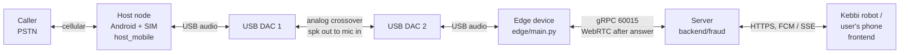
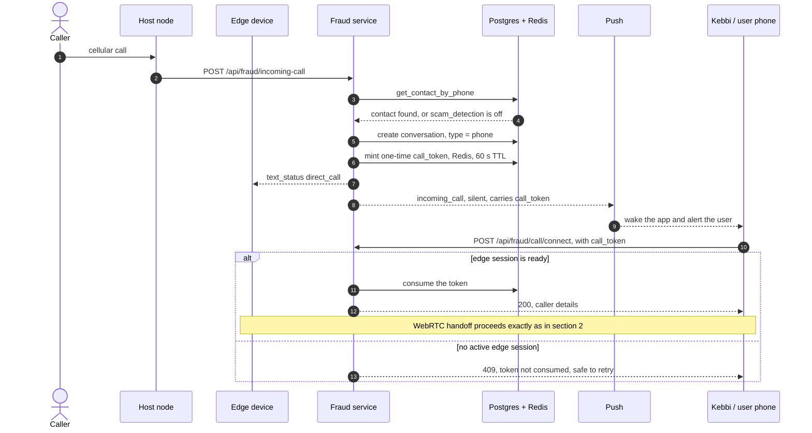
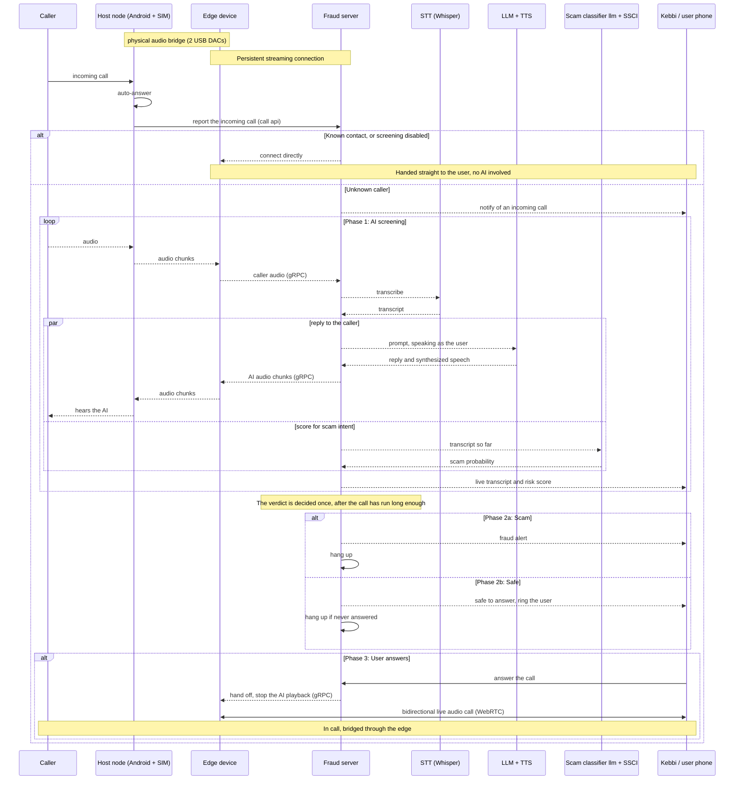

# SafeCall — End-to-end call flow

How an incoming PSTN call is answered by the AI, transcribed, scored, and either dropped or handed
off to the real user.

Companion docs: [`API_SPEC.md`](./API_SPEC.md) (HTTP + gRPC contracts),
[`PUSH_NOTIFICATION_SPEC.md`](./PUSH_NOTIFICATION_SPEC.md) (payload catalogue),
[`FRONTEND_SSCI_CALLER_TYPE.md`](./FRONTEND_SSCI_CALLER_TYPE.md) (SSCI display rules).

---

## 1. Physical and network topology

The caller reaches a real Android phone with a SIM. That phone's call audio crosses into the edge
device **as analog audio over a pair of USB DACs**, wired as a crossover — each DAC's speaker output
feeds the other's mic input. Everything from the edge rightwards is IP.



> **Note:** the DAC bridge is a hardware arrangement only. Neither `host_mobile` nor `edge` selects
> an audio device in code — `edge/main.py` opens the default PortAudio device, and `host_mobile`
> only offers earpiece/speaker routing. The OS defaults must be configured by hand.

---

## 2. Fraud-screening path — detailed

The main flow, for an unknown caller when `scam_detection` is on. The AI answers as the user, every
utterance is transcribed and scored, and the user watches it live.

```mermaid
sequenceDiagram
    autonumber
    actor Caller
    participant Host as Host node<br/>Android + SIM
    participant Edge as Edge device<br/>edge/main.py
    participant Sess as gRPC session<br/>voice_session.py
    participant STT as Whisper STT<br/>RealtimeSTT
    participant LLM as LLM<br/>gpt-4o-mini
    participant TTS as TTS<br/>Supertonic / OpenAI
    participant Clf as Scam classifier<br/>external API
    participant SSCI as SSCI compute<br/>ssci.py
    participant DB as Postgres
    participant Push as Push<br/>Redis to FCM / SSE
    participant Kebbi as Kebbi / user phone

    Note over Edge,Sess: Startup: edge resolves its token from env, cached .edge_token, or QR pairing,<br/>then opens VoiceService.Session, one bidirectional gRPC stream on port 60015
    Sess->>STT: initialize recorder, warm up

    Note over Caller,Kebbi: Call setup
    Caller->>Host: cellular call, phone rings
    Host->>Host: blocked-number check
    Host->>Host: auto-answer after 1500 ms
    Host->>Sess: POST /api/fraud/incoming-call
    Sess->>DB: get_contact_by_phone
    DB-->>Sess: contact row or null
    Sess->>Sess: detect_caller_type, contact / non_contact / private
    Sess->>DB: create conversation, type = phone
    DB-->>Sess: conversation_id
    Sess->>DB: save system message, anti-fraud persona prompt
    Sess-->>Edge: text_status incoming_call, mic goes live
    Sess-->>Push: incoming_call, visible
    Push-->>Kebbi: opens CallPage

    loop Phase 1: AI screening, one iteration per caller utterance
        Caller->>Host: speaks
        Host-->>Edge: analog audio in, USB DAC crossover
        Edge->>Edge: sd.InputStream callback, 512-sample int16 frames
        Edge->>Sess: audio_chunk, 16 kHz mono PCM
        Sess->>STT: feed_audio
        STT->>STT: VAD, realtime tiny model, then final transcription
        STT-->>Sess: final transcript
        Sess-->>Edge: text_status stt_result
        Sess->>DB: save user message
        Sess-->>Push: call_new_message, role user
        Push-->>Kebbi: transcript line appears

        par 1a: reply to the caller
            Sess->>LLM: chat.completions, full history, persona is the user
            LLM-->>Sess: reply text
            Sess->>DB: save assistant message
            Sess-->>Edge: text_status llm_response
            Sess-->>Push: call_new_message, role assistant
            Push-->>Kebbi: AI line appears
            Sess->>TTS: synthesize reply
            TTS-->>Sess: PCM, resampled to 16 kHz
            Sess-->>Edge: audio_response, 1024-byte chunks
            Sess-->>Edge: text_status playback_complete
            Edge->>Edge: playback worker writes to sd.OutputStream
            Edge-->>Host: analog audio out, USB DAC crossover
            Host-->>Caller: hears the AI persona
        and 1b: score the conversation for scam intent
            Sess->>DB: fetch full user and assistant transcript
            DB-->>Sess: conversation text
            Sess->>Clf: POST text
            Clf-->>Sess: true or false
            Sess->>Sess: append to raw_results, inference_index + 1
            Sess->>DB: write metadata.detection on last user message
            alt every 3rd inference (INFERENCES_PER_TRIGGER = 3)
                Sess->>SSCI: compute_ssci, trigger history and caller_type
                SSCI->>SSCI: evidence, agreement, stability
                SSCI->>SSCI: blend identity prior, weight 0.8 times 1 minus evidence
                SSCI-->>Sess: scam_probability, scam_threshold, sub-scores
                Sess->>DB: write metadata.detection.ssci
                Sess-->>Push: ssci_update
                Push-->>Kebbi: SSCI panel, displayed from trigger_index 2
            end
        end

        opt Barge-in: caller talks over the AI
            Edge->>Edge: Silero VAD probability above 0.85 while AI is playing
            Edge->>Sess: interrupt
            Edge->>Edge: 50 ms fade-out, drain playback queue
            Sess->>Sess: cancel the in-flight LLM and TTS task
        end
    end

    Note over Sess,SSCI: The verdict below fires at most once per call,<br/>and only once call age reaches 120 s

    alt Phase 2a: Scam determined (scam_probability > scam_threshold)
        Sess->>DB: update conversation metadata.scam_probability
        Sess-->>Push: fraud_alert
        Push-->>Kebbi: high-risk warning UI
        Sess->>Sess: wait 30 s grace
        Sess->>Sess: cancel AI generation, stop talking to the caller
        Sess->>Sess: wait until 90 s total
    else Phase 2b: Not scam (scam_probability <= scam_threshold)
        Sess->>DB: update conversation metadata.scam_probability
        Sess-->>Push: safe_to_answer, visible, this is the ring
        Push-->>Kebbi: safe-to-answer banner and ring
        Sess->>Sess: wait 180 s
    end

    alt Phase 3a: User answers, hand off to bidirectional call
        Kebbi->>Sess: POST /api/fraud/answer-call
        Sess->>Sess: cancel the SSCI action timer
        Sess->>STT: stop and shut down recorder, free GPU memory
        Sess-->>Edge: text_status direct_call
        Edge->>Edge: stop sending audio_chunk
        Edge->>Edge: build RTCPeerConnection and caller audio track, gather ICE
        Edge->>Sess: signal, kind offer, sdp
        Sess->>Sess: cache the offer
        Kebbi->>Sess: GET /api/fraud/webrtc/offer, polled up to 20 times
        Sess-->>Kebbi: status ready, sdp
        Kebbi->>Kebbi: getUserMedia audio, set remote, create answer
        Kebbi->>Sess: POST /api/fraud/webrtc/answer
        Sess-->>Edge: signal, kind answer, sdp
        Edge->>Edge: setRemoteDescription
        Note over Edge,Kebbi: Media is now peer to peer.<br/>STT, LLM and TTS are all out of the loop.
        Caller->>Host: voice
        Host-->>Edge: analog in
        Edge->>Kebbi: RTP, resampled 16 to 48 kHz, 20 ms frames
        Kebbi->>Edge: RTP, the user's voice
        Edge-->>Host: analog out, resampled 48 to 16 kHz
        Host-->>Caller: hears the real user
    else Phase 3b: Timeout with no user action, auto hangup
        Sess->>Sess: end call due to SSCI
        Sess-->>Edge: text_status call_end
        Sess-->>Push: hangup, to host_mobile and kebbi
        Push-->>Host: force-terminate the cellular call
        Push-->>Kebbi: close the call UI
    else Phase 3c: Caller hangs up first
        Host->>Sess: POST /api/fraud/call-end
        Sess->>DB: update conversation duration_seconds
        Sess-->>Edge: text_status call_end
        Sess-->>Push: call_ended
        Push-->>Kebbi: show CallSummaryPage
        Edge->>Edge: tear down WebRTC, reset state, await the next call
    end
```



---

## 3. Direct-call path — known contact, or fraud detection off

If the caller is in the user's `contacts` table, or the user has `scam_detection` disabled, there is
no AI screening, no STT, no LLM and no SSCI.



---

## 4. Transport reference

### gRPC — `VoiceService.Session()`, bidirectional, port 60015

| Direction | Field | Meaning |
|---|---|---|
| edge to server | `audio_chunk` | raw 16 kHz mono int16 PCM |
| edge to server | `interrupt` | VAD barge-in, stop TTS now |
| edge to server | `signal` | `{"kind":"offer","sdp":...}` |
| server to edge | `audio_response` | TTS PCM, 1024-byte chunks |
| server to edge | `signal` | `{"kind":"answer","sdp":...}` |
| server to edge | `text_status` | `incoming_call`, `direct_call`, `stt_result`, `llm_response`, `playback_complete`, `call_end` |

Auth is the edge token in the `authorization` metadata header.

### Push — Redis stream to FCM data messages, with SSE fallback

There is **no WebSocket** in this architecture. Realtime updates to the app are individual pushes.

| Event | App | Visible | When |
|---|---|---|---|
| `incoming_call` | kebbi | yes / no | call registered; the silent form carries `call_token` |
| `call_new_message` | kebbi | no | each finalized STT line and each LLM reply |
| `call_update_message` | kebbi | no | a transcript line was revised |
| `call_delete_message` | kebbi | no | a superseded line was dropped |
| `ssci_update` | kebbi | no | every 3rd inference, roughly every 6 sentences |
| `fraud_alert` | kebbi | no | once per call, scam verdict |
| `safe_to_answer` | kebbi | yes | once per call, safe verdict |
| `call_ended` | kebbi, host_mobile | no | call finished |
| `hangup` | host_mobile, kebbi | no | force-terminate |

SSE fallback: `GET /api/push/events/{app}`, used when FCM token acquisition fails.

---

## 5. Timing constants

Defined in `backend/fraud/src/const.py`.

| Constant | Value | Effect |
|---|---|---|
| `INFERENCES_PER_TRIGGER` | 3 | SSCI recomputed every 3rd classifier call |
| `SSCI_MAX_DURATION_SECONDS` | 120 s | earliest an alert or safe verdict may fire |
| `SSCI_SCAM_GRACE_SECONDS` | 30 s | after `fraud_alert`, before the AI is silenced |
| `SSCI_SCAM_WAIT_SECONDS` | 90 s | after `fraud_alert`, before auto-hangup |
| `SSCI_SAFE_WAIT_SECONDS` | 180 s | after `safe_to_answer`, before auto-hangup |

Scam thresholds by caller type: contact **0.40**, non_contact **0.50**, private **0.55**.

SSCI is computed from the boolean history of the external classifier plus a caller-identity prior.
It does **not** analyse audio:

```
evidence   = 1 - exp(-n_k / 12),  n_k = 6k
agreement  = time-decayed match rate vs the latest decision, Beta-smoothed
stability  = exp(-1.5 * flip_EMA)
raw        = evidence * agreement * stability
confidence = (1 - w) * raw + w * identity_prior,   w = 0.8 * (1 - evidence)
scam_probability = confidence if the latest decision is scam, else 1 - confidence
```

Because the prior weight decays as evidence grows, caller identity dominates early in a call and
fades as the dialogue lengthens. See `backend/fraud/src/ssci.py`.

---

## 6. Combined overview — all phases on one diagram

A plain-language view of the whole call, showing only the key components and the order things
happen in. Endpoint names, wire formats and timings are deliberately left out — see sections 2 to 5
for those.


